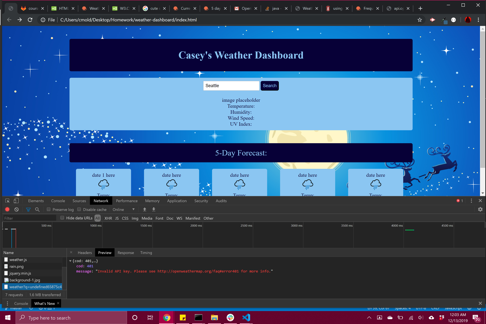
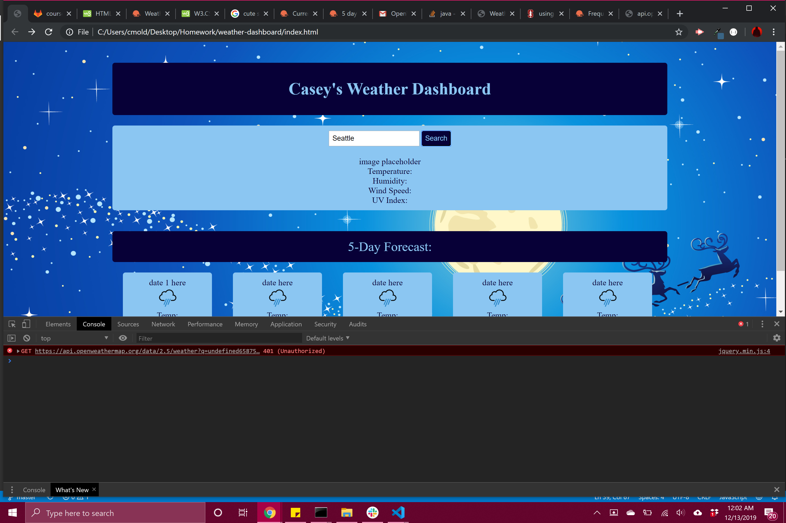
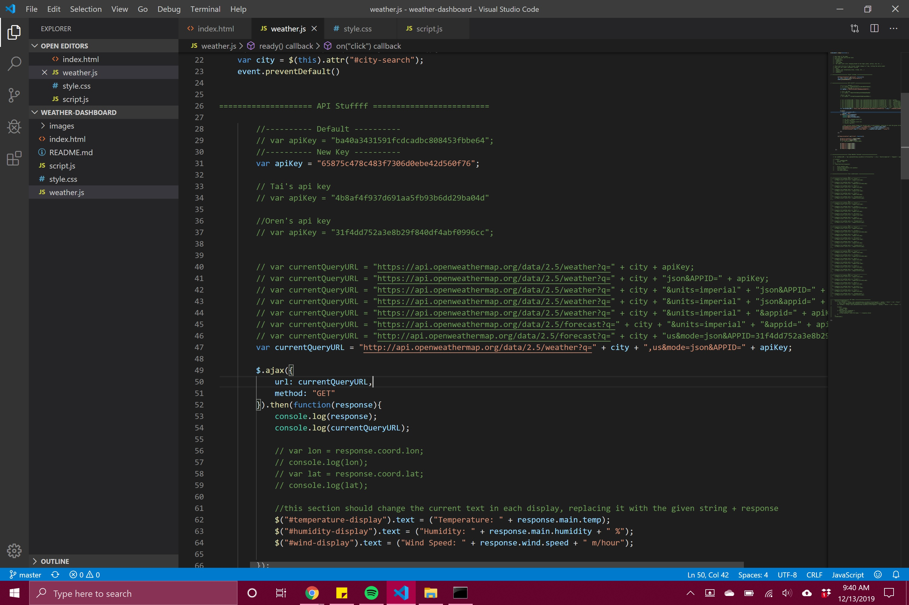
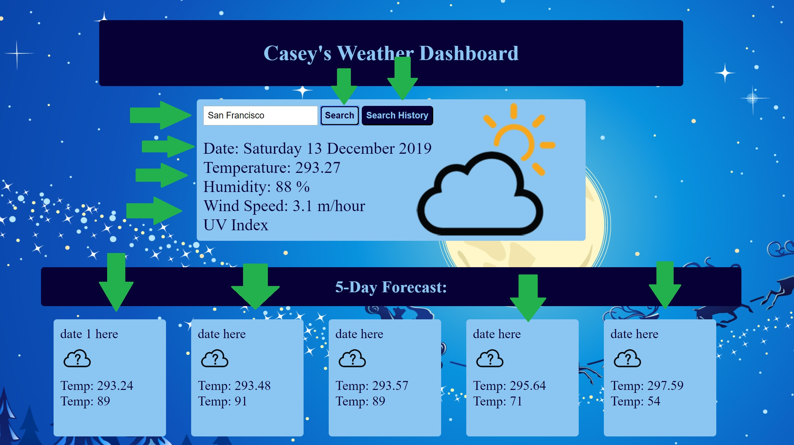

# Project Title: Weather Dashboard
​
# Project Description:
A brief description of my project. We were tasked with creating an interactive weather application that takes in the user's city input, saves the result and projects it onto the page listing various stats and features. This included temperature, humidity, wind speeds and the uv index along with date, an image to correspond with the current weather conditions and a 5 day forecast (to include similar info each on days to come). Though i am ultimatly pleased with the appearance and presentation of what i've made, i will say that i am, in no way, pleased with its functionality. This project has been, by far, the most confusing, frustrating and challenging project since i began my studies with Berkeley Extension. I spent a large amount of my time....no....a Rediculous amount of time, fighting against elements within the OpenWeather API that made absolutely zero sense. Just last night, i dedicated over 7 hours trying to figure out how to get my API Key to work with the given links provided on the OpenWeather API's site. I tried hundreds of variations in the URL and used over 7 API Keys (3 of which belonged to other people who were struggling with very similar challenges and were attempting to lend aid where they could). What was incredibly infuriating in this was the fact that, after going to bed in a huff of mental exhaustion and defeat, i awoke the next day to find that everything was now magically working on its own. There was no explination or logic. just some kind of crazy tech voodoo magic that i may never understand. The worst in all of this lay in the fact that i was unable to move forward with the project as my progreess was completely blocked without the return data that the API and API key was supposed to give. i had no way of testing my code to better understand the material and utilize hands-on learning. I had to settle for completing as much as i could (mostly in psudo code) and pray that the following morning i could get aid from a TA or the instructor. As im writing this now, i have already come to realize that it is impossible to complete this project in time due to this unexplained occurance...so might as well complete the README.md.
​
## Getting Started
​
i Started this project like any other, forming the needed files and folders. For this i created an index.html, style.css and a script.js along with an images folder to store weather icons and background options. I went in knowing this project would be a challenge so i did what i always do. i started framing the HTML page followed by the style.css. This part was not as enjoyable as it typically tends to be as i decided to make things extra challenging by programming everything in css without a css API. Normally i prefer this approach but in the case of a complicated project such as this, simplicity should have been a priority wherever i could afford it. Ironically, this was not made obvious until it was too late to redo or change.

After completing the html and css i began working on the script.js. As you may have read above in the project description, this was an incredibly taxing challenge, one that i did not walk away from in the happiest of moods. I encountered many issues that made little to no sense. i'd get an error in one attempt, only for things to somehow magically get fixed without alterations to any code in the next. I encountered three specific errors quite often, being the: 400, 401 and 404 errors. The 401 was the most common and referred to having an inaccurate API code, despite me using one issued by OpenWeather upon signing up. One of these codes would litterally work one minute and then sunddenly break the next. I must have generated about 4 or 5 codes in the end and even used the codes of others. And before you ask...or think to ask, yes, i did comply with the suggested wait times given by OpenWeather in the user's API Key screen, giving each more than enough time. I also struggled with the Default code given (the day before). Oh and yes, i consulted Google, Bing, Yahoo Answers. you name it, i searched it. Nothing seemed to work.

The images above are of my errors. Will also include an image below listing just a very very small few of my API attempts.

After over 7 hours of struggle, i coded what i could without the API functioning and went to bed. The next morning, everything suddenly worked completely fine. a mistery i will never understand and also one that gives me great concern in using 3rd party APIs...and yes, i know everyone does it. Just voicing my thoughts. I definitely don't plan to avoid them. I may just avoid OpenWeather. It has become my new arch nemesis and i will never forgive their evil transgressions unless they find a way to return the 7 hours of my life wasted on their crappy, soul stealing, sanity degenerating product.

Once the API began working...somehow, i began working as well, putting into effect everything i could, escentially starting the project from almost the beginning...on the day it was due. I will say this, it's crazy that i mannaged to complete as much as i have. But the self praise ends there. i was able to complete the search button and search bar features, the icon, temperature and humidity displays along with the wind speeds... 

Sadly my accomplishments ended there and still aren't completely working the way they should. For some reason, regardless of the city i put into the API to be called back, the only response is Orlando...i don't know why. I've tried changing the API codes and links as well as the functions surrounding the search bar and search button event listener but these chanegs had no effect. I was also able to create a dropdown button to store search history but sadly this also failed somewhat as i encountered issues with getItem from local stroage to be placed within it. For some reason, icon images also are reluctant to properly display but i thankfully managed to fill out all other information in the 5day Forecast. Again, this refers only to Orlando....so if i ever plan to sell this app, i have my target audience already in mind. As for the icons...ill just make then sunny all the time. who can argue with that level of joy.
​
### Prerequisites
​
Sanity....lots and lots of sanity. Enough to afford great losses.
​
​
​
## Built With

bits and pieces of my soul...and these:​

* [HTML](https://developer.mozilla.org/en-US/docs/Web/HTML)
* [CSS](https://developer.mozilla.org/en-US/docs/Web/CSS)
* [Javascript](https://developer.mozilla.org/en-US/docs/Web/JavaScript)
​
## Deployed Link
​
* [See Live Site](#)
​
​
## Authors
​
* **YOUR NAME** 
​
- [Link to Portfolio Site](#)
- [Link to Github](https://github.com/)
- [Link to LinkedIn](https://www.linkedin.com/)
​
See also the list of [contributors](https://github.com/your/project/contributors) who participated in this project.
​
## License
​
This project is licensed under the MIT License 
​
## Acknowledgments
​
* Hat tip to anyone whose code, libraries, packages, or UI was used  / inspired from
* Inspiration
* etc